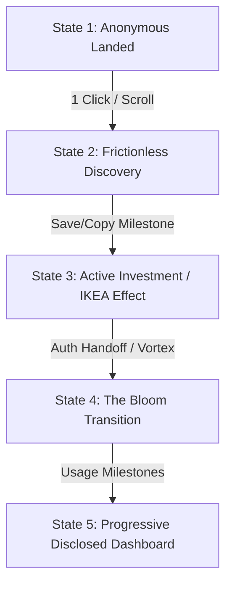

# CONVERSION & ONBOARDING CONTEXT — Struq

This file serves as a detailed context map and architectural guide for AI agents working on Struq's conversion funnel, psychological onboarding flow, progressive disclosure framework, and monetization gating.

Struq is a **visual-first library + vault** for AI-native builders: palettes, typography, design systems, sections, and media. Prompts are metadata on these visual assets, never the primary entity.

---

## 1. The 5 User Lifecycle States (The Funnel Path)

The Struq conversion funnel is designed psychologically to move users from anonymous visual delight to paid subscription with minimal cognitive friction.

### State 1: The Anonymous Landing (Aesthetic-Usability)
*   **Concept:** Hook visitors with premium cinematic visuals and immediate loading speed. No questionnaire walls or signup hurdles.
*   **Mechanics:**
    *   [LoaderCounter](file:///c:/Users/Royhe/Documents/Coding/Projects/1Personal/StruqVisual/components/site/loaders/loader-counter.tsx) acts as a session-gated cover page. It counts up to 100 based on font and above-the-fold image loads, then performs a GSAP `yPercent: -100` wipe-up to reveal the landing hero.
    *   The session gate is managed client-side by [use-first-visit.ts](file:///c:/Users/Royhe/Documents/Coding/Projects/1Personal/StruqVisual/components/site/loaders/use-first-visit.ts) to prevent the intro loader from showing on subsequent page navigations.
    *   The homepage layout uses a highly coordinated GSAP-driven narrative order: Hero $\rightarrow$ proof-marquee $\rightarrow$ problem $\rightarrow$ insight $\rightarrow$ four-forms $\rightarrow$ showcase $\rightarrow$ how-it-works $\rightarrow$ blueprint $\rightarrow$ vault $\rightarrow$ memory-field $\rightarrow$ pricing $\rightarrow$ faq (see [home-client.tsx](file:///c:/Users/Royhe/Documents/Coding/Projects/1Personal/StruqVisual/components/site/home/home-client.tsx)).

### State 2: Frictionless Library Discovery (<=30s to First Value)
*   **Concept:** Allow users to browse and see the value of the assets before prompting for credentials.
*   **Mechanics:**
    *   Visitors browse visual assets directly inside the `/vault` search and filter view via [VaultBrowser](file:///c:/Users/Royhe/Documents/Coding/Projects/1Personal/StruqVisual/components/vault/vault-browser.tsx).
    *   Search entries reset active categories to `all` to prevent empty states. Previews are statically loaded with zero layout shift or flashes.
    *   **Hick's Law:** Beginners are presented with only 3–4 destination categories, hiding advanced customization until usage increases.

### State 3: Active Investment (The IKEA Effect)
*   **Concept:** Once a user performs a save/collect action, they invest personal value into their vault. This sunk utility makes signup natural.
*   **Mechanics:**
    *   [AssetCard](file:///c:/Users/Royhe/Documents/Coding/Projects/1Personal/StruqVisual/components/vault/asset-card.tsx) handles bookmarks and prompt-copy triggers.
    *   When logged out, favorites are persisted in `localStorage` under `struq_saved_assets_v1` by [use-saved-assets.ts](file:///c:/Users/Royhe/Documents/Coding/Projects/1Personal/StruqVisual/hooks/use-saved-assets.ts). Component sync is managed through a custom event dispatch (`struq:saved-assets-changed`).
    *   [MaturityProvider](file:///c:/Users/Royhe/Documents/Coding/Projects/1Personal/StruqVisual/components/maturity-provider.tsx) tracks saves and copies as milestones under `struq_maturity_v1`.
    *   **Gating Trigger:** Free assets are copied instantly. Pro assets are fully visible (with honest visual previews) but their prompt payload is server-gated. Tapping a Pro copy button redirects to the `/pro` page rather than displaying a jarring modal banner.
    *   **The funnel middle:** [SignupNudge](file:///c:/Users/Royhe/Documents/Coding/Projects/1Personal/StruqVisual/components/vault/signup-nudge.tsx), rendered by `VaultBrowser` above the grid, appears only when anonymous (`!dbMode`) and `savedIds.length >= 1`. Honest loss-aversion copy ("je vault leeft alleen in deze browser"), escalates once at `>=3` saves (the existing Level 2 threshold), CTA → `/auth?next=/vault`. Dismissal is per-level and sticky in `localStorage` (`struq_signup_nudge_dismissed_v1`) — never reappears once dismissed at that level.
    *   All marketing CTAs (hero, navbar, footer, memory-field, home/vault, pricing-free, methode, visueel) point to `/vault`, not `/auth` — the anonymous browse/save experience is now actually reachable from the homepage. Navbar keeps a small secondary "Inloggen" link. Pricing-pro CTA → `/auth?next=/pro`.

### State 4: The Bloom / Handoff Crossover
*   **Concept:** Eliminate the visual seam between authentication success and dashboard rendering.
*   **Mechanics:**
    *   [AuthClient](file:///c:/Users/Royhe/Documents/Coding/Projects/1Personal/StruqVisual/components/site/auth/auth-client.tsx) renders the login/signup form surrounded by a dynamic Canvas vortex ([auth-particles.tsx](file:///c:/Users/Royhe/Documents/Coding/Projects/1Personal/StruqVisual/components/site/auth/auth-particles.tsx)).
    *   On successful login, the form plays a high-velocity particle acceleration ending in a full-screen warm cream shockwave (`#ffe8cc`).
    *   The auth handler calls `markHandoff()` in [handoff.ts](file:///c:/Users/Royhe/Documents/Coding/Projects/1Personal/StruqVisual/lib/handoff.ts), storing a session flag and caching the wash color.
    *   `AuthClient` reads `useSearchParams().get('next')`, validates it's an internal path (`safeNextPath`: must start with `/`, no `//`), and uses it — instead of a hardcoded `/dashboard` — for the handoff navigation, the safety-net timeout, and the OAuth `callbackUrl`. Defaults to `/dashboard` when absent/invalid. This is what lets `pricing.tsx`'s `/auth?next=/pro` and the signup nudge's `/auth?next=/vault` land the user back where they meant to go.
    *   The client router pushes to `nextPath` (usually `/dashboard`) where [DashboardEntrance](file:///c:/Users/Royhe/Documents/Coding/Projects/1Personal/StruqVisual/components/dashboard/dashboard-entrance.tsx) immediately mounts a curtain in the identical `#ffe8cc` color when the target is the dashboard.
    *   Once the dashboard paints behind the curtain, it wipes upward, firing the `dashboard:reveal` event so cards rise staggering underneath.
    *   Direct visits/refreshes skip the wash and use a light canvas curtain (`#fbf8f2`) to keep the experience smooth and quiet.

### State 5: Progressive Disclosed Dashboard
*   **Concept:** The dashboard surfaces adapt based on experience level. Unlocks feel like progress (Goal-gradient effect) and never regress (milestones are cached).
*   **Mechanics:**
    *   [MaturityProvider](file:///c:/Users/Royhe/Documents/Coding/Projects/1Personal/StruqVisual/components/maturity-provider.tsx) manages maturity levels:
        *   `Level 0`: browse + save + copy ( frictionless baseline ).
        *   `Level 1` (>=1 save): Unlocks category filters, the "Bewaard" (Saved) filter tab, and a teaser for Kits.
        *   `Level 2` (>=3 saves or >=3 copies): Unlocks the full Kits editor and the MCP teaser.
    *   Sidebar navigation links, bottom bar icons, and vault control filters check `canSee('filters' | 'saved-view' | 'kits' | 'mcp-teaser')` to conditionally render.

---

## 2. Core Codebase Directory & File Map

### A. Onboarding & Transitions
*   [components/maturity-provider.tsx](file:///c:/Users/Royhe/Documents/Coding/Projects/1Personal/StruqVisual/components/maturity-provider.tsx)
    *   `MaturityProvider` & `useMaturity()` hook.
    *   Stores user milestones (`saves`, `copies`) and unlocks surfaces.
*   [lib/handoff.ts](file:///c:/Users/Royhe/Documents/Coding/Projects/1Personal/StruqVisual/lib/handoff.ts)
    *   Defines handoff key `handoff:dashboard`, wash color `#ffe8cc`, and the custom reveal event `dashboard:reveal`.
*   [components/dashboard/dashboard-entrance.tsx](file:///c:/Users/Royhe/Documents/Coding/Projects/1Personal/StruqVisual/components/dashboard/dashboard-entrance.tsx)
    *   Handles the handoff curtain lift animation via GSAP (`yPercent: -100`, `ease: 'power4.inOut'`).
*   [components/providers/PageTransition.tsx](file:///c:/Users/Royhe/Documents/Coding/Projects/1Personal/StruqVisual/components/providers/PageTransition.tsx)
    *   Overlay wipe-up router transition provider. Captures link clicks and blocks navigation until the transition curtain covers the viewport.
*   [components/site/loaders/loader-counter.tsx](file:///c:/Users/Royhe/Documents/Coding/Projects/1Personal/StruqVisual/components/site/loaders/loader-counter.tsx)
    *   The warm-cream count-up loader for the first visit of a browser session.

### B. Vault & Saved State
*   [hooks/use-saved-assets.ts](file:///c:/Users/Royhe/Documents/Coding/Projects/1Personal/StruqVisual/hooks/use-saved-assets.ts)
    *   Manages favorites. Toggles between Local Mode (using `localStorage`) and Authenticated DB Mode (making requests to `/api/favorites`).
*   [components/vault/asset-card.tsx](file:///c:/Users/Royhe/Documents/Coding/Projects/1Personal/StruqVisual/components/vault/asset-card.tsx)
    *   Renders visual previews and controls. Tracks copy clicks via `recordCopy()` and saves via `recordSave()`.
*   [components/vault/vault-browser.tsx](file:///c:/Users/Royhe/Documents/Coding/Projects/1Personal/StruqVisual/components/vault/vault-browser.tsx)
    *   Controls the vault categories, favorites search, and grid layout. Uses `useMaturity` to conditionally display the saved assets tab.

### C. Gating & Database Enforcement
*   [lib/db/repository.ts](file:///c:/Users/Royhe/Documents/Coding/Projects/1Personal/StruqVisual/lib/db/repository.ts)
    *   The primary server-side security gate.
    *   `toVaultAsset` strips the `prompt` string for any Pro asset if the `viewerTier` is `free`, setting `locked: true` instead.
    *   `getAssetPromptForViewer` serves as the second check for copying. It fetches and returns prompt text *only* if the session user is entitled to Pro.
*   [app/api/assets/\[id\]/prompt/route.ts](file:///c:/Users/Royhe/Documents/Coding/Projects/1Personal/StruqVisual/app/api/assets/[id]/prompt/route.ts)
    *   API endpoint hit by `AssetCard` during prompt copying. Returns 403 on missing authorization.
*   [app/api/favorites/route.ts](file:///c:/Users/Royhe/Documents/Coding/Projects/1Personal/StruqVisual/app/api/favorites/route.ts)
    *   Handles retrieving and updating database-backed favorites when a user has a valid `struq_uid` session.

---

## 3. Psychological Design Constraints

Every design change must comply with the styling and motion constraints defined in [DESIGN.md](file:///c:/Users/Royhe/Documents/Coding/Projects/1Personal/StruqVisual/DESIGN.md):

*   **Two Motion Registers (Strictly Segregated):**
    *   *Marketing Register (Public/Landing):* Cinematic, immersive. Uses Lenis smooth scroll, GSAP ScrollTrigger, and Three.js memory field.
    *   *App Register (Dashboard/Vault):* Fast, task-focused, 120–220ms durations with standard `ease-out`. **No Lenis, no scroll-jacking, no parallax.**
*   **The Design Gate:**
    *   `npm run verify:design` runs a design linter. It prevents hardcoded gray/blue color scales, hex codes in Tailwind classes, excessive typography weights (`font-extrabold`), or em-dashes in visible copy.

---

## 4. Open Funnel Seams (Roadmap and Optimization Items)

When planning structure or layout changes, consider the following gaps in the current implementation:

1.  **~~Anonymous-to-Authenticated Saved Asset Migration~~ — RESOLVED (conversion-funnel-fundament slice).**
    *   *Current behavior:* [use-saved-assets.ts](file:///c:/Users/Royhe/Documents/Coding/Projects/1Personal/StruqVisual/hooks/use-saved-assets.ts)'s session-probe effect now merges any pending `localStorage` ids into the DB the moment the `/api/favorites` GET confirms an authenticated session (200), before falling back to plain hydration. A module-level guard (`migrationStarted`) ensures only one mounted consumer fires the merge per page load, even though every card/nav badge/saved-view mounts this hook. On success, the local key is cleared and the change event fires so every consumer re-syncs.
    *   *Server side:* `POST /api/favorites` now accepts an optional `{ assetIds: string[] }` batch (in addition to the existing single `{ assetId }` toggle) and routes to the new `mergeFavorites()` in [repository.ts](file:///c:/Users/Royhe/Documents/Coding/Projects/1Personal/StruqVisual/lib/db/repository.ts) — idempotent (composite PK `onConflictDoNothing`), filters out ids that don't exist in `assets` (no FK violation on stale/foreign ids), returns the full merged `savedIds`.
    *   *Covered by:* `tests/e2e/conversion-funnel.spec.ts` (migration test seeds a local save, signs up fresh, asserts the DB reflects it and the local key clears).
2.  **Stripe Tier Webhooks:**
    *   *Current behavior:* Users are gated on `users.tier` ('free' | 'pro'). The `/pro` upgrade page is a static detail sheet.
    *   *Task:* Design the Stripe checkout session loop and verification webhook handler to automatically bump `users.tier` to `'pro'` upon checkout confirmation.
3.  **Dynamic Milestones:**
    *   *Current behavior:* Maturity level relies exclusively on client-side saves and copies.
    *   *Task:* Hook maturity parameters to database events (e.g. number of kits created or whether an MCP token was registered).
